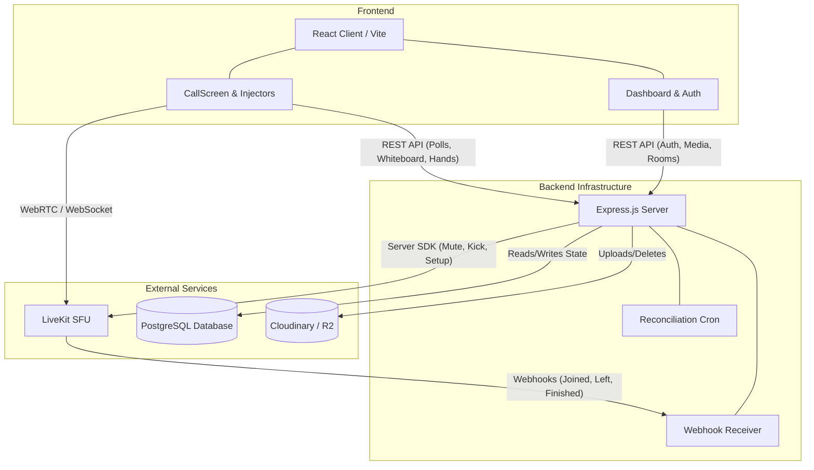
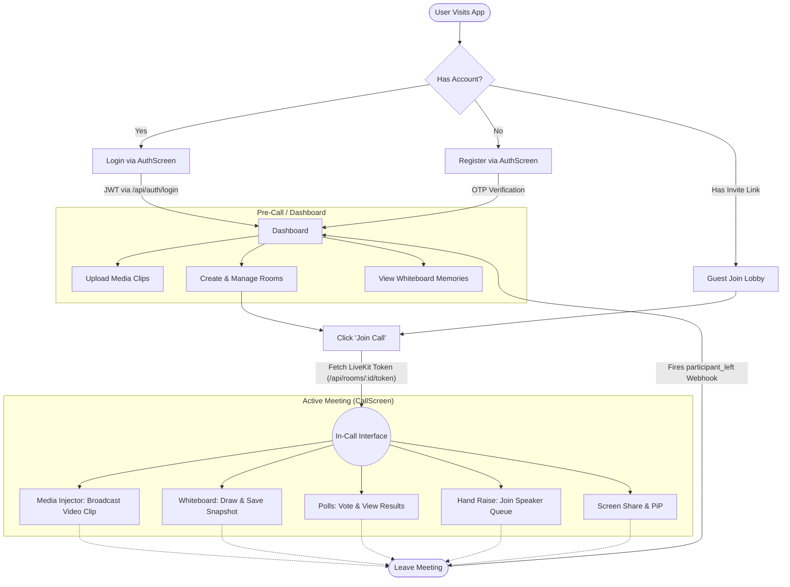
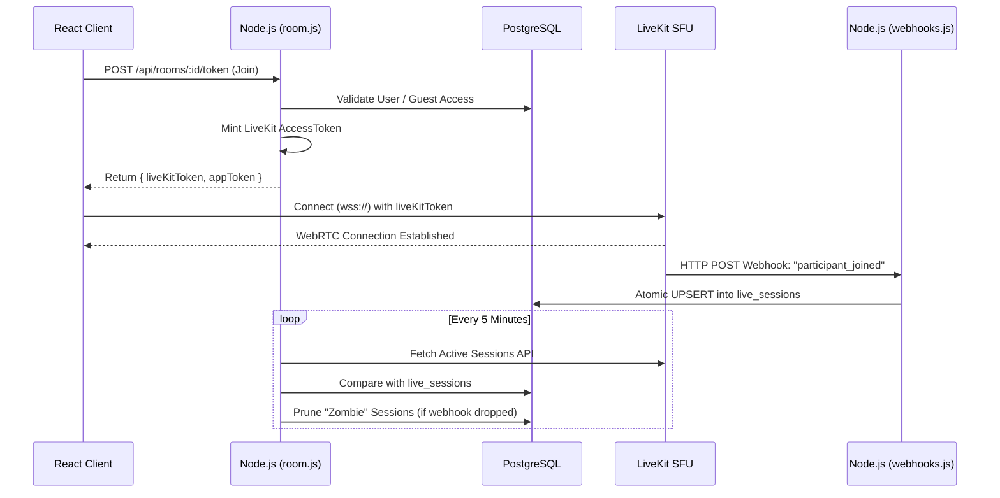

# OmniCall Architecture & Flow Diagrams

This document outlines the complete system architecture of OmniCall based on the current codebase. It explains how the React frontend, Node.js backend, PostgreSQL database, LiveKit SFU, and External Storage interact to provide a seamless real-time experience.

---

## 1. High-Level System Architecture

At its core, OmniCall separates **Signaling & Media Routing** (handled by LiveKit) from **Persistent State & Authentication** (handled by our Node.js/PostgreSQL backend). 



---

## 2. User Flow & Application Journey

This diagram illustrates the step-by-step journey a user takes through the application—from landing and authentication to in-call collaboration and leaving the meeting.



---

## 3. Call Connection & Session Tracking Flow

OmniCall uses a strict token-gated connection process. LiveKit never trusts the client directly; it only trusts signed `AccessTokens` generated by our Node.js backend. To keep track of exactly who is online, the backend listens to LiveKit Webhooks.



### Key Codebase Mechanisms:
* **Atomic UPSERTS:** In `webhooks.js`, we use `INSERT ... ON CONFLICT DO UPDATE` so if a user experiences network flapping, we don't create duplicate session records.
* **Zombie Reconciliation:** The cron job in `room.js` acts as a self-healing mechanism in case LiveKit's webhooks fail to reach our server due to network errors.

---

## 4. Real-Time Collaboration (Polls, Hands, Whiteboard)

For features like Polls, Hand Raising, and the Whiteboard, OmniCall uses a **"Persist-First, Broadcast-Second"** architecture. State is safely locked in the database first, then broadcasted ephemerally via LiveKit DataPackets.

```mermaid
sequenceDiagram
    participant P1 as User A (React)
    participant API as Node.js Backend
    participant DB as PostgreSQL
    participant LK as LiveKit DataChannels
    participant P2 as User B (React)

    Note over P1, P2: Example: Raising a Hand
    
    P1->>API: POST /api/rooms/:id/raise-hand
    
    %% Race Condition Prevention
    rect rgb(20, 40, 60)
        Note right of API: Database Transaction
        API->>DB: Acquire pg_advisory_xact_lock (Block concurrent requests)
        API->>DB: Get MAX(sequence_number)
        API->>DB: INSERT hand_raise (seq + 1)
    end
    
    API-->>P1: 200 OK (Hand Raised)
    
    %% Real-time sync
    P1->>LK: Send DataPacket (Topic: "hand-raise")
    LK-->>P2: Deliver DataPacket
    P2->>API: GET /api/rooms/:id/hand-raises (Fetch authoritative state)
    API-->>P2: Return ordered queue
```



### Key Codebase Mechanisms:
* **Advisory Locks:** Found in `room.js`, we use PostgreSQL advisory locks `pg_advisory_xact_lock(hashtext(...))` when raising hands to prevent sequence-number collisions if two users click exactly at the same millisecond.
* **Keyset Pagination:** The Whiteboard and Chat endpoints use `(created_at, id) > ($1, $2)` to infinitely scroll without database performance degradation.

---

## 5. Media Injection & Storage Flow

The Media Injector allows users to bypass their webcam and stream pre-uploaded video/audio files directly into the LiveKit mesh.

```mermaid
graph TD
    subgraph Dashboard Phase
        Client1[React UI] -- "1. Upload File (FormData)" --> Server[Node.js (media.js)]
        Server -- "2. Upload Stream" --> Storage[(Cloudinary / R2)]
        Server -- "3. Save Metadata" --> DB[(PostgreSQL)]
    end

    subgraph In-Call Phase
        Client2[CallScreen / MediaInjector.jsx]
        Client2 -- "4. Fetch Clips" --> DB
        Client2 -- "5. Download Media Blob" --> Storage
        Client2 -- "6. Create LocalVideoTrack" --> Client2
        Client2 -- "7. Replace Camera Track" --> LiveKit[LiveKit SFU]
        LiveKit -- "8. Broadcast as Webcam" --> Peers[Other Participants]
    end
    
    %% Styling
    style Client1 fill:#1a365d,stroke:#93c5fd
    style Client2 fill:#1a365d,stroke:#93c5fd
```

### Key Codebase Mechanisms:
* **Track Replacement:** In `MediaInjector.jsx`, when a user selects a clip, the app creates an HTML `<video>` element, captures its stream using `.captureStream()`, wraps it in a LiveKit `LocalVideoTrack`, and *unpublishes* the real webcam track, substituting the video file.
* **Fault-Tolerant Deletions:** When clearing the media library, `media.js` uses `Promise.allSettled()`. If Cloudinary is temporarily down, the file's metadata is preserved in a `cleanup_failures` table so it can be retried later, rather than deleting the DB record and permanently losing track of the file.
